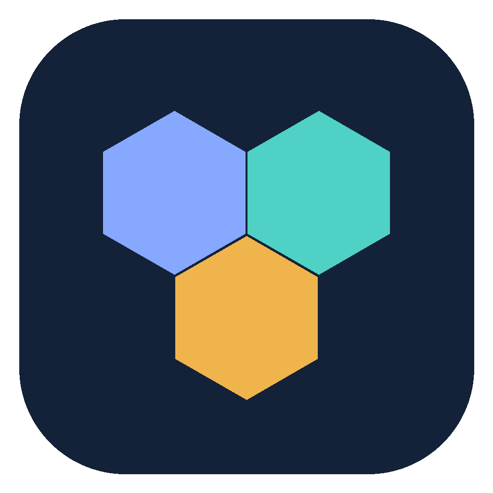
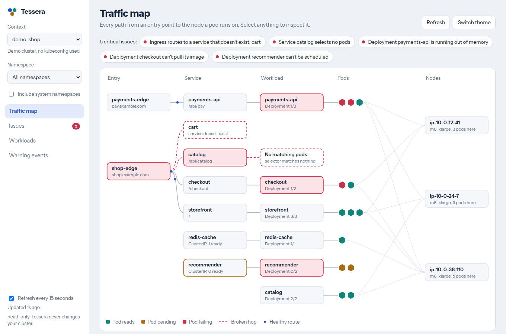
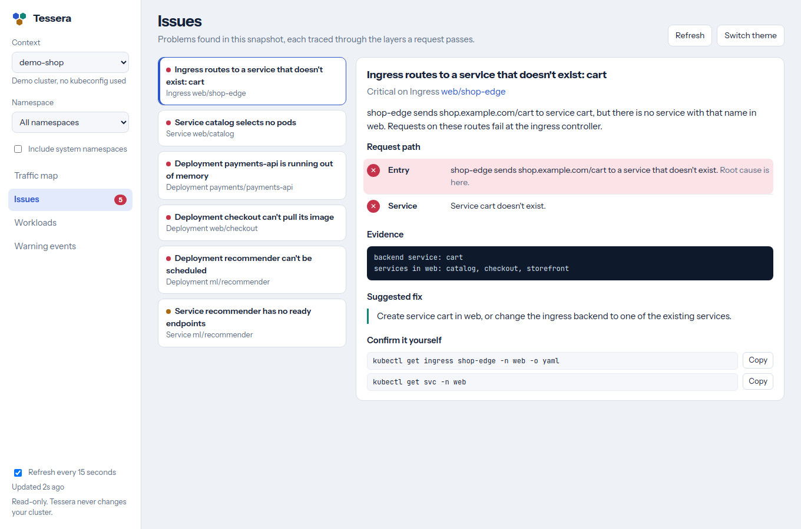
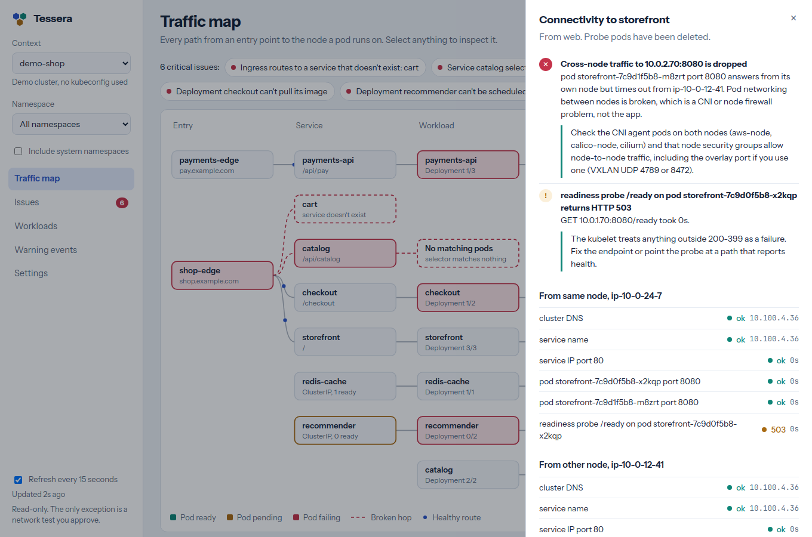

<p align="center"></p>

<h1 align="center">Tessera</h1>

<p align="center">A read-only Kubernetes desktop app that shows you <em>where</em> a request breaks.</p>

<p align="center">
  <a href="https://github.com/ManvithaP-hub/tessera/actions/workflows/ci.yml"></a>
  <a href="LICENSE"></a>
</p>



Most Kubernetes GUIs show you lists of resources. When something is down, you
still have to work out which hop failed: the ingress, the service, the pods, or
the node they should be running on. Tessera draws every request path from the
entry point to the node, marks the broken hop, and tells you why it's broken
and what to change.

## What it does

- **Traffic map.** Ingress and load balancer entry points, services, workloads,
  pods and nodes, connected the way traffic actually flows. Broken hops are
  drawn in red.
- **Diagnosis across 12 categories.** Routing, network policies, cluster DNS,
  service mesh (Istio), images, config and admission policies, storage,
  scheduling, quotas, autoscaling, crashes and probes, and nodes. See the
  [full list of checks](docs/architecture.md#diagnosis-rules).
- **Root cause, not symptoms.** Pod findings are grouped per workload, and a
  service with no endpoints is marked as a symptom when its pods explain why.
- **Evidence you can check.** Every issue lists what was observed and the
  read-only `kubectl` commands to confirm it yourself.
- **Cloud load balancer target health (AWS).** Which ALB, NLB or Classic ELB
  targets are unhealthy and why (wrong status code, timeouts, AZ not enabled,
  stale targets), cross-checked with your readiness probes. GKE backend health
  is read straight from the ingress.
- **Network tests you approve.** Probe pods on the target's node and on another
  node test DNS, the service IP, each pod IP and the pods' own health
  endpoints. Comparing them tells apart DNS faults, kube-proxy faults,
  cross-node CNI faults, NetworkPolicy drops, and apps not listening.
- **Pod networking and probe health.** CNI agents and kube-proxy not ready, VPC
  CNI IP exhaustion, nodes with NetworkUnavailable, probe ports that don't
  exist, probes timing out, liveness checks identical to readiness, and slow
  starters killed by liveness.
- **Pod logs,** including the previous container after a crash.
- **Any cluster your kubeconfig reaches.** EKS, GKE, AKS, kind, k3s and others,
  including exec credential plugins such as `aws eks get-token`.





## Guardrails

Tessera is built to be safe to point at production.

| Area | Guardrail |
|---|---|
| Cluster access | **Read-only by default**: only `get`, `list` and pod logs. Minimal role in [`docs/rbac.yaml`](docs/rbac.yaml) |
| Identity | Uses each context's own kubeconfig identity, so it can never do more than `kubectl` could |
| Network tests | You see the exact probe pods first; nothing runs until you approve. Probe pods are non-root, have no token or capabilities, stop after 90 seconds and are always deleted |
| **Production protection** | Production contexts are detected by name, shown with a red banner, and **network tests are off** there by default. If allowed, you must type the context name. Enforced in the backend |
| **Per-cluster settings** | AWS profile, region and probe image are kept separately per context, so one account's settings never apply to another |
| **Organisation policy** | An optional policy file can turn features off, limit or hide contexts, and change how production is detected. A system-managed file overrides users and fails safe |
| **Activity log** | Every network test, the pods it created and deleted, and every blocked attempt is recorded locally |
| Cloud checks | Opt-in; only five read-only AWS `describe` commands, using each cluster's own profile. Minimal IAM policy in [`docs/iam-policy.json`](docs/iam-policy.json) |
| Credentials and privacy | Nothing stored, no telemetry, and the UI has no file, shell or network access |

## Multiple clusters, accounts and regions

Tessera works with every context in your kubeconfig, one at a time and fully
isolated. Give each cluster a clear alias and its own profile:

```sh
aws eks update-kubeconfig --name payments --region us-east-1 --profile dev-sso  --alias dev-use1-payments
aws eks update-kubeconfig --name payments --region us-west-2 --profile prod-sso --alias prod-usw2-payments
```

`prod-usw2-payments` is then recognised as production, and cloud checks for
each cluster use that cluster's own AWS account and region.

**Full guide:** [docs/multi-environment.md](docs/multi-environment.md) covers
SSO profiles, environment detection, recommended RBAC and IAM, the policy file
format, and the activity log.

## Install

Download the installer for your platform from
[Releases](https://github.com/ManvithaP-hub/tessera/releases):

| Your computer | Download |
|---|---|
| Mac with Apple Silicon (M1 or later) | `Tessera_<version>_aarch64.dmg` |
| Mac with an Intel chip | `Tessera_<version>_x64.dmg` |
| Windows | `Tessera_<version>_x64-setup.exe` (or the `.msi`) |
| Linux | `.AppImage`, `.deb` or `.rpm` |

Not sure which Mac you have? Apple menu → **About This Mac**: "Chip: Apple M…" means Apple Silicon, "Processor: Intel" means Intel. Or run `uname -m` in Terminal: `arm64` is Apple Silicon, `x86_64` is Intel. The wrong one fails with "incorrect executable format".

On a Mac, open the `.dmg` and drag **Tessera** into **Applications**.

Early builds are not code-signed yet:

- **macOS:** if macOS says the app is damaged or can't be opened, run
  `xattr -dr com.apple.quarantine /Applications/Tessera.app` once.
- **Windows:** in the SmartScreen prompt, select *More info*, then *Run anyway*.

Tessera reads `$KUBECONFIG` or `~/.kube/config`. If `kubectl get pods` works in
your terminal, Tessera will too.

## Build from source

Prerequisites: Rust (stable), Node.js 22+, and the
[Tauri system dependencies](https://v2.tauri.app/start/prerequisites/) for your OS.

```sh
git clone https://github.com/ManvithaP-hub/tessera
cd tessera
npm install
npm run tauri dev        # run the desktop app
npm run tauri build      # build an installer for this OS
```

To work on the UI without a cluster, run `npm run dev` and open
<http://localhost:1420>. In a plain browser Tessera uses built-in demo data.

## Project layout

```
crates/tessera-core   Rust engine: kubeconfig, snapshot, diagnosis rules, tests
src-tauri             Desktop shell (Tauri 2)
src                   TypeScript UI
docs                  Architecture notes and RBAC example
```

See [docs/architecture.md](docs/architecture.md) for how the pieces fit and how
to add a diagnosis rule.

## Roadmap

- Watch-based live updates instead of polling
- Azure load balancer and Application Gateway health; GKE L4 load balancers
- Testing from a specific workload's point of view (ephemeral containers)
- Gateway API, Linkerd and Traefik routes
- Optional AI explanation of an issue using a model you choose (your own API
  key, Amazon Bedrock in your account, or a local model), off by default
- Signed and notarized builds

## Contributing

Issues and pull requests are welcome. Please read
[CONTRIBUTING.md](CONTRIBUTING.md) first; the short version is that Tessera
stays read-only and every diagnosis needs evidence and a test.

## License

Apache License 2.0. See [LICENSE](LICENSE) and [NOTICE](NOTICE).
